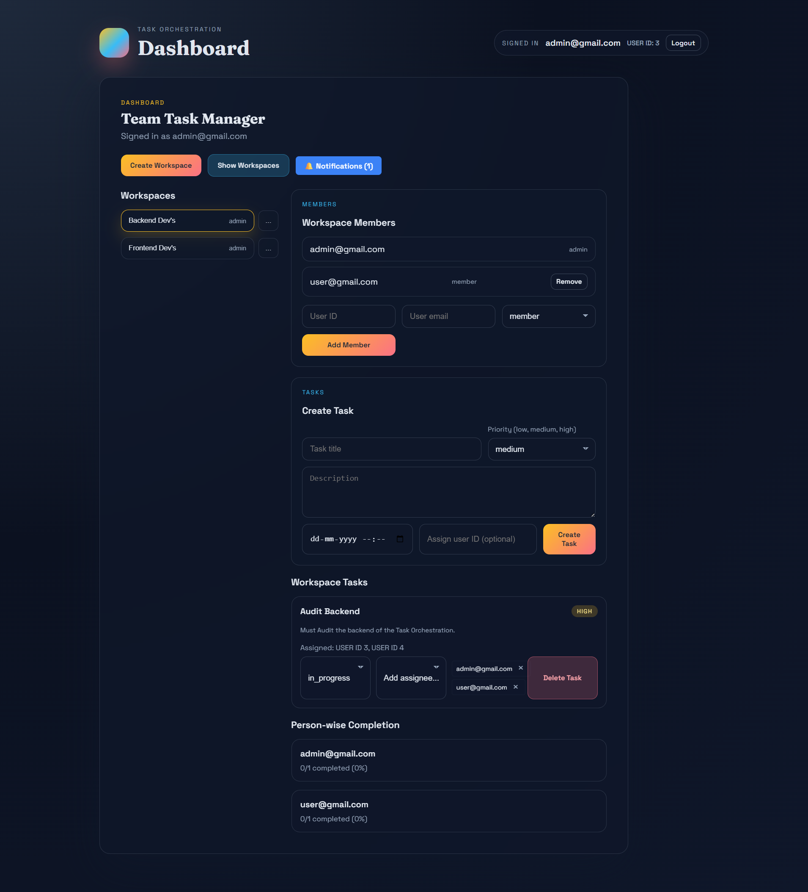
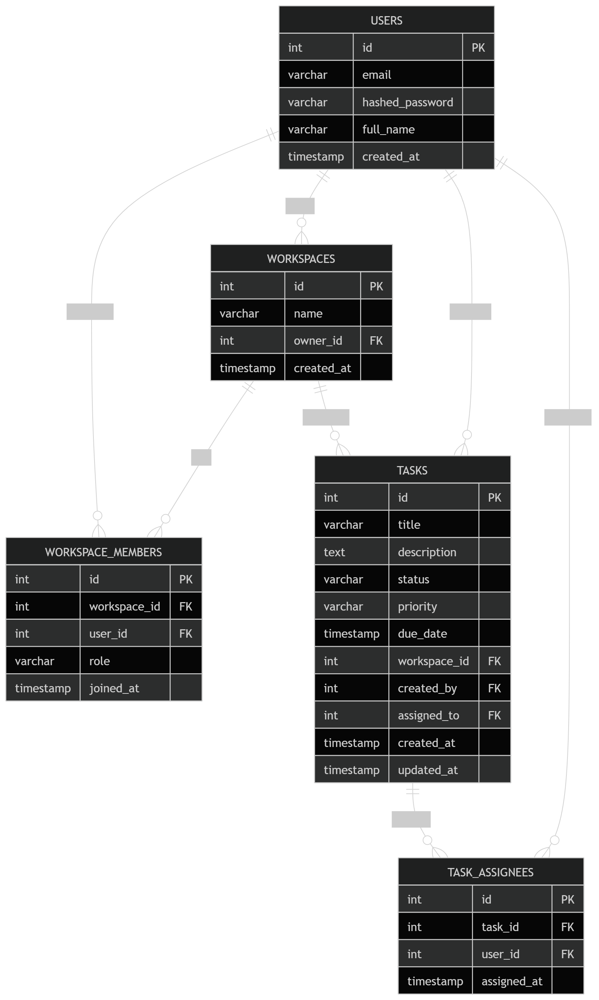

# Team Task Manager — Task Orchestration System

    

<p align="center">
  
  <h3>Team Task Manager — RBAC-enabled task & workspace orchestration</h3>
  <sub>FastAPI backend • React + TypeScript frontend • PostgreSQL</sub>
</p>

---

## Table of Contents

- [About](#about)
- [Tech Stack](#tech-stack)
- [Features](#features)
- [Architecture & ER Diagram](#architecture--er-diagram)
- [Project Structure](#project-structure)
- [Prerequisites](#prerequisites)
- [Quickstart (Development)](#quickstart-development)
  - [1. Database setup](#1-database-setup)
  - [2. Backend setup (FastAPI)](#2-backend-setup-fastapi)
  - [3. Frontend setup (React + Vite)](#3-frontend-setup-react--vite)
- [API Endpoints & Documentation](#api-endpoints--documentation)
- [Database Inspection](#database-inspection)
- [Testing](#testing)
- [Deployment Notes](#deployment-notes)
- [Contributing](#contributing)
- [License](#license)
- [Maintainer & Contact](#maintainer--contact)

---

## About

The **Team Task Manager** is a production-oriented, full-stack application that enables teams to manage workspaces and tasks with role-based access control (RBAC). It supports multi-assignee tasks, workspace roles (admin/member), JWT authentication, notifications for assigned tasks, and a dashboard that tracks progress and overdue items.

## Tech Stack

- Backend: Python 3.12, FastAPI, SQLAlchemy, Alembic, Pydantic
- Frontend: React 18, TypeScript, Vite
- Database: PostgreSQL 15+
- Auth: JWT (HS256)

## Features

- Secure registration, login, and logout with password hashing and validation
- Workspace-level RBAC (admin/member)
- Task CRUD with multi-assignees, status, priority, and due dates
- Workspace member management
- Notifications for assigned tasks
- Dashboard with workspace statistics and overdue tasks

## Architecture & ER Diagram

The application uses a 3-tier architecture (Presentation, Application, Data). The ER diagram is included below.



Mermaid source and DOT/SVG files are available in the repository root: `ER_Diagram.md`, `ER_Diagram.dot`, `ER_Diagram.svg`.

## Project Structure

```
team-task-manager/
├── backend/                 # FastAPI application
│   ├── app/
│   │   ├── api/            # API routers
│   │   ├── core/           # Config, security, db connection
│   │   ├── models/         # SQLAlchemy models
│   │   ├── schemas/        # Pydantic schemas
│   │   └── main.py         # App entrypoint
│   ├── alembic/            # Migrations
│   ├── requirements.txt
│   └── .env.example        # Environment variables template
├── frontend/               # React + Vite app
│   ├── src/
│   │   ├── components/
│   │   ├── pages/
│   │   ├── api/
│   │   └── main.tsx
│   ├── package.json
│   └── public/
├── assets/                 # Images and diagrams
├── db_inspect_queries.sql  # Helper SQL queries
└── README.md
```

## Prerequisites

- Node.js (v18+) and npm
- Python (v3.12+)
- PostgreSQL (v15+) running locally, WSL, or in Docker
- Git

---

## Quickstart (Development)

### 1. Database setup

Start PostgreSQL and create the project database:

```sql
CREATE DATABASE task_orchestration_db;
```

### 2. Backend setup (FastAPI)

```bash
cd backend
python -m venv .venv
source .venv/bin/activate   # Windows: .venv\\Scripts\\activate
pip install -r requirements.txt
cp .env.example .env        # update values in .env
alembic upgrade head        # run migrations
uvicorn app.main:app --reload --host 0.0.0.0 --port 8000
```

Swagger UI: http://127.0.0.1:8000/docs

### 3. Frontend setup (React + Vite)

```bash
cd frontend
npm install
npm run dev
```

Open: http://localhost:5173

## API Endpoints & Documentation

Interactive docs are available (Swagger and ReDoc) via the running backend.

The Postman collection is included at `backend/docs/postman_collection.json`.

Key endpoints overview:

| Category   | Method | Endpoint                          | Description                       |
|------------|--------|-----------------------------------|-----------------------------------|
| Auth       | POST   | /auth/register                    | Register a new user               |
| Auth       | POST   | /auth/login                       | Obtain JWT token                  |
| Users      | GET    | /users/me                         | Get current user profile          |
| Workspaces | POST   | /workspaces                       | Create a workspace                |
| Workspaces | GET    | /workspaces                       | List user workspaces              |
| Workspaces | DELETE | /workspaces/{id}                  | Delete workspace (Admin only)     |
| Tasks      | POST   | /tasks                            | Create a task                     |
| Tasks      | GET    | /tasks                            | List tasks (workspace)            |
| Tasks      | PATCH  | /tasks/{id}/status                | Update task status                |
| Tasks      | POST   | /tasks/{id}/assignees             | Add assignee to a task            |

## Database Inspection

Use the helper SQL file `db_inspect_queries.sql` or run queries with `psql`:

```bash
psql -h localhost -U <db_user> -d task_orchestration_db
\i db_inspect_queries.sql
```

Useful manual queries:

- List tables: `\dt`
- Describe columns for a table:

```sql
SELECT column_name, data_type, is_nullable, column_default
FROM information_schema.columns
WHERE table_name = 'tasks';
```

- Count rows per table:

```sql
SELECT 'users' AS table_name, COUNT(*) FROM users
UNION ALL
SELECT 'workspaces', COUNT(*) FROM workspaces
UNION ALL
SELECT 'tasks', COUNT(*) FROM tasks;
```

- Find overdue tasks:

```sql
SELECT * FROM tasks
WHERE due_date < now() AND status <> 'done';
```

## Testing

Backend tests (if present) run with pytest:

```bash
cd backend
pytest
```

## Deployment Notes

- Use Gunicorn with Uvicorn workers for production.
- Use managed Postgres in production and run `alembic upgrade head` during deploys.
- Keep secrets in environment variables or a secrets manager; do not commit `.env`.
- Build frontend with `npm run build` and serve `dist/` via Nginx or CDN.

## Contributing

1. Fork the repository
2. Create a feature branch: `git checkout -b feature/YourFeature`
3. Commit changes and push
4. Open a pull request

## License

MIT License

## Maintainer & Contact

**Rangdal Pavansai**

- 📧 pavansai.20066@gmail.com
- 💼 https://linkedin.com/in/rangdal-pavansai

---